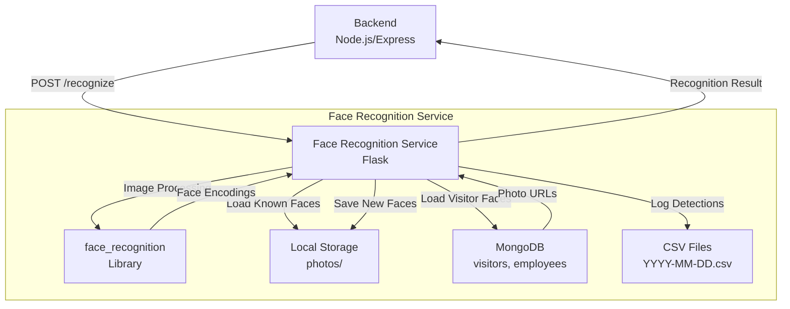

# Projet Avatar IA Interactif - Reconnaissance Faciale

## 📖 Description

Ce dépôt contient le code source du **service de reconnaissance faciale** pour le projet **Avatar IA Interactif pour Accueil Intelligent**. Ce service Python, basé sur Flask, est conçu pour identifier les employés et visiteurs en temps réel à l'aide de la bibliothèque `face_recognition`. Il s'intègre avec le backend principal [](https://github.com/Abirgharbi/final-virtual-avatar-backend) via l'endpoint `/recognize` et stocke les données dans MongoDB.

Le service charge les visages connus depuis un répertoire local (`photos/`) et MongoDB (pour les visiteurs), effectue la reconnaissance faciale sur les images envoyées, et journalise les détections dans des fichiers CSV quotidiens.

## 🎯 Objectifs du Projet

- **Automatisation** : Identifier les employés et visiteurs via reconnaissance faciale en temps réel.
- **Intégration** : Fournir un endpoint RESTful (`/recognize`) pour le backend principal.
- **Journalisation** : Enregistrer les détections dans des fichiers CSV pour le suivi.

## 🏛️ Architecture



Explication :

- Le backend Node.js envoie des images au service Flask via /recognize.
- Le service Flask utilise face_recognition pour analyser les images.
- Les visages connus sont chargés depuis le répertoire photos/ (employés) et MongoDB (visiteurs).
- Les détections sont journalisées dans des fichiers CSV.
- Les nouveaux visages sont sauvegardés dans photos/ pour l'apprentissage progressif.

## 🚀 Fonctionnalités Principales

### Reconnaissance Faciale
- **Endpoint `/recognize`** : Reçoit une image (POST), identifie les visages à l’aide du modèle CNN (`convolutional neural network`) de la bibliothèque `face_recognition`, et renvoie le statut (`known`, `unknown`, `no_face`, `ambiguous`) avec les détails (nom, email, type, localisation).
- **Types d'utilisateurs** : Distingue les employés (stockés localement dans `photos/`) et les visiteurs (stockés dans MongoDB).
- **Tolérance** : Utilise un seuil de tolérance (0.5) pour éviter les faux positifs, avec une vérification de la deuxième meilleure correspondance pour améliorer la précision.

### Gestion des Données
- **Chargement des visages** : Charge les visages des employés depuis le répertoire `photos/` et des visiteurs depuis MongoDB (champ `photoPath`).
- **Journalisation** : Enregistre chaque détection dans un fichier CSV quotidien (`YYYY-MM-DD.csv`) avec le nom, la date, et l’heure.
- **Apprentissage progressif** : Sauvegarde les nouveaux visages dans `photos/` pour une reconnaissance future.

### Intégration
- **MongoDB** : Récupère les données des visiteurs (collection `visitors`) et employés (collection `employees`).
- **Backend principal** : Fournit des réponses JSON pour une intégration fluide avec le backend Node.js [](https://github.com/Abirgharbi/final-virtual-avatar-backend).

## 🗂️ Structure du Projet
- **facedetect.py** : Point d'entrée principal, configure Flask, charge les visages, et définit les endpoints (`/recognize`, `/reload-encodings`).
- **photos/** : Répertoire contenant les images des employés (organisées en sous-dossiers par nom).
- **YYYY-MM-DD.csv** : Fichiers CSV générés quotidiennement pour journaliser les détections.

## 🛠️ Technologies Utilisées
- **Langage** : Python 3.8+
- **Framework** : Flask
- **Reconnaissance faciale** : face_recognition (utilisant un modèle CNN basé sur dlib)
- **Base de données** : MongoDB (via pymongo)
- **Autres** :
  - OpenCV (cv2) pour le traitement d'images
  - NumPy pour les calculs de distance
  - urllib pour télécharger les images des visiteurs
  - CSV pour la journalisation
 
## 🛠️ Technologies Utilisées

1. Clonez le dépôt :
```bash
git clone https://github.com/Abirgharbi/Face_recognition.git
cd Face_recognition
```

2. Installez les dépendances :
```bash
pip install -r requirements.txt
```

## 📋 Guide

### Tests :
- **Reconnaissance faciale** : Testez `/recognize` (POST avec une image JPEG). Vérifiez les statuts (`known`, `unknown`, `no_face`, `ambiguous`) et les détails renvoyés (nom, email, type).
- **Rechargement des encodages** : Testez `/reload-encodings` après ajout de nouvelles images dans `photos/` ou MongoDB.
- **Journalisation** : Vérifiez les fichiers CSV générés (`YYYY-MM-DD.csv`) pour les détections.
- **MongoDB** : Assurez-vous que les visiteurs sont correctement chargés depuis la collection `visitors`.


  

